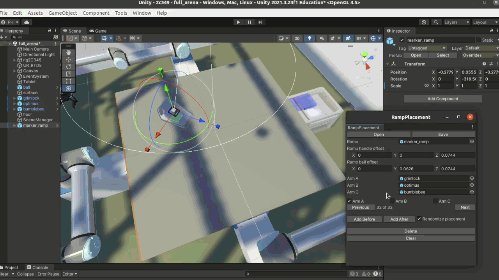

# Ramp Placement (for 2c349)

## Summary

This package adds a user interface for rapidly placing the ramp in the 2c349 scene as needed for a series of ball-fetching experiments. The details of the placements can be saved in a JSON file, which then can be read by code that needs the position and angle of the UR robot arm's tool when it is placing the ramp and dropping the ball for each experiment.

## Installation

Follow the [installation instructions for a package in janelia-unity-toolkit](https://github.com/JaneliaSciComp/janelia-unity-toolkit/blob/master/README.md#installation).

## Details

### User Interface

The Unity editor's "Window" menu has a "Ramp Placement" item that launches a panel for managing the ramp placements.

The "Ramp handle offset" field is a Vector3 specifying the displacment from the position (center) of the ramp to the position where the robot arm's tool can grab the handle for placing the ramp. This vector should be specified for the default orientation of the ramp, with its _z_ axis pointing the same direction as the "surface" object's _z_ axis.

Similarly, the "Ramp ball offset" field is a Vector3 for the displaement from the ramp's position to where the robot arm's tool can drop the ball so it rolls down the ramp.

When the Ramp Placement panel is present, then interactive manipulation of the ramp is constrained, so the ramp cannot be moved off the "surface" object or out of reach of the chosen robot arm. To stop enforcement of these constraints, close the Ramp Placement panel.

### JSON Output File Format

* `"rampName"`: string
* `"rampHandleOffset"`: Vector3, default value
* `"rampBallOffset"`: Vector3, default value
* `"placements"`: array of objects, with each object as follows:
    * `"reachingArmName"`: string
    * `"reachingArmBase"`: Vector3, world coordinates
    * `"rampPosition"`: Vector3, world coordinates
    * `"rampAngleY"`: float
    * `"rampHandlePosition"`: Vector3, wrold coordinates
    * `"rampBallPosition"`: Vector3, world coordinates
